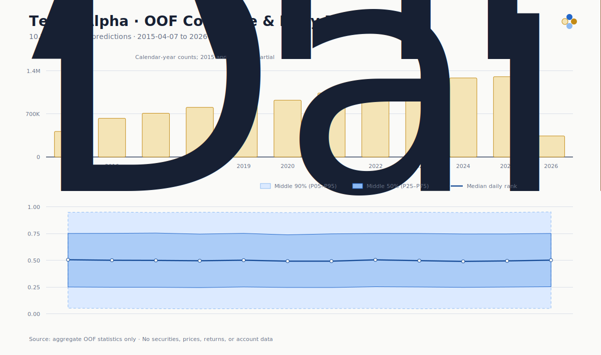
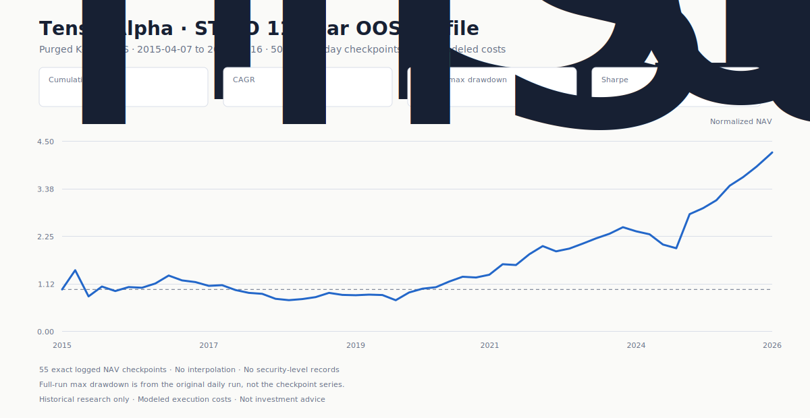
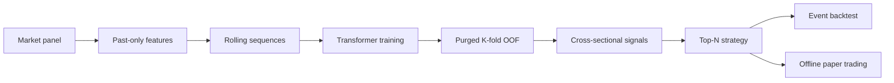

# TensorAlpha

[](https://github.com/yyf0202/TensorAlpha/actions/workflows/ci.yml)
[](https://www.python.org/)
[](LICENSE)

TensorAlpha is a compact, end-to-end Transformer research toolkit for equity ranking. It connects market data, past-only features, model training, purged K-fold out-of-fold predictions, A-share-aware event backtesting, and persistent offline paper trading through one installable Python package.

This public repository is a clean-room release of the maintained Transformer workflow. It contains source code, tests, documentation, aggregate OOF statistics, sanitized aggregate OOS checkpoints, and synthetic examples—never private credentials, licensed raw market data, model weights, security-level predictions, or trading-account records.

> Research software only. Nothing in this repository is investment advice or a promise of future performance.

## What is included

- Canonical long-form OHLCV schema, atomic Parquet storage, and optional Tushare adapter
- Past-only momentum, volatility, price-position, and liquidity features
- PyTorch Transformer ranker with portable model artifacts
- Expanding-window K-fold training with explicit purge gaps and OOF assembly
- Cross-sectional Rank IC diagnostics and privacy-preserving OOF showcase tools
- Event-driven execution with T+1, board-lot, suspension, price-limit, commission, stamp-tax, and slippage rules
- Shared Top-N strategy semantics for backtesting and offline paper trading
- Deterministic synthetic data for demos and CI; no network or credentials required

## Visual showcase

The aggregate OOF profile covers 10,725,368 predictions across 2015–2026. Bars count OOF prediction rows, not securities; 2015 and 2026 are partial years. A daily rank score is a cross-sectional percentile from 0 (lowest that day) to 1 (highest that day), not points, probability, price, or return. The dark line is the annual median, while the dark and light bands contain the middle 50% and 90% of ranks. This is real aggregate model-output metadata, but it contains no security-level records, prices, returns, or portfolio performance.



The second chart is the privacy-preserving profile of **TensorAlpha STK-O**, the strongest overall strategy in the documented three-period comparison available on 2026-04-18. Its daily ranks combine ME at 0.4, CE_Liq at 0.2, and V46ME S43 at 0.4. It is selected over a standalone V46ME seed because the comparison rewards consistency across the long OOS history and the recent OOS window, rather than cherry-picking the highest historical return.

Under the standard research definition—Top 10, minimum CNY 3 billion circulating market value, minimum CNY 50 million daily amount, at most two holdings per sector, T+1 execution, 0.2% slippage, 0.03% commission, and 0.05% stamp tax—the 2015-04-07 to 2026-03-16 Purged K-Fold OOS run recorded **+324.37% cumulative return**, **+14.68% CAGR**, **-55.88% maximum drawdown**, and **0.5894 Sharpe** over 2,659 trading days. The drawdown is severe and is part of the result, not hidden.



The public curve contains 55 exact logged NAV checkpoints (day 1, every 50th trading day, and the final day), not an interpolated daily series. Maximum drawdown is the metric from the original full daily run. No securities, prices, per-security returns, orders, holdings, model paths, or account data are included. This is historical research, not live performance, and the selection label is not a promise of future performance.

Regenerate both README SVG files with `python scripts/render_showcase.py`. Add `--include-synthetic` to also rebuild the deterministic execution-demo chart. The renderer uses no plotting dependency and produces identical output for identical inputs.

## Five-minute demo

```bash
python -m venv .venv

# macOS / Linux
source .venv/bin/activate

# Windows PowerShell
.venv\Scripts\Activate.ps1

pip install -e ".[dev]"
tensoralpha demo --output artifacts/demo --days 260 --assets 40
```

The demo writes synthetic market data and signals plus `backtest_nav.csv`, `backtest_nav.svg`, `backtest_trades.csv`, and `summary.json`. All identifiers use the `DEMO0001` form, and every price and return is simulated.

Equivalent checked-in profiles can be run with `tensoralpha run-config configs/demo.json`; the files under `configs/` use the same CLI contract and contain no hidden defaults.

## Real-data workflow

### 1. Fetch or provide a market panel

Tushare is optional and its token is read only from the environment:

```bash
pip install -e ".[data]"
export TENSORALPHA_TUSHARE_TOKEN="<your-token>"
tensoralpha fetch-data --start 2015-01-01 --end 2025-12-31 --output data/market.parquet
```

On PowerShell, set the variable for the current process with `$env:TENSORALPHA_TUSHARE_TOKEN="<your-token>"`. Never commit a populated `.env` file.

You may also provide a CSV or Parquet panel with:

```text
date, symbol, open, high, low, close, volume, amount
```

Units are shares for `volume` and CNY for `amount`. Rows must be unique by `(date, symbol)`.

### 2. Train one Transformer

```bash
tensoralpha train \
  --market data/market.parquet \
  --output artifacts/models/transformer \
  --sequence-length 60 \
  --horizon 1 \
  --epochs 20
```

The artifact contains JSON metadata and PyTorch weights. Generated weights are ignored by Git.

### 3. Generate purged OOF predictions

```bash
tensoralpha oof \
  --market data/market.parquet \
  --output artifacts/oof \
  --folds 5 \
  --purge-days 20 \
  --min-train-days 756 \
  --sequence-length 60
```

Every validation prediction comes from a model that did not train on that validation window. The purge gap protects sequence and forward-label boundaries.

### 4. Backtest signals

```bash
tensoralpha backtest \
  --market data/market.parquet \
  --signals artifacts/oof/oof_predictions.parquet \
  --output artifacts/backtest \
  --top-n 10
```

Signals observed after day T's close become targets for day T+1. Orders execute at the next open subject to market constraints.

### 5. Run an offline paper account

```bash
tensoralpha paper-create --account artifacts/paper/demo --initial-cash 1000000 --top-n 10
tensoralpha paper-tick --account artifacts/paper/demo --market one_day.csv --signals one_day_signals.csv
```

Paper trading is an offline state machine. It does not connect to a broker or place live orders.

## 11-year OOF showcase

[`examples/data/transformer_11y_oof_summary.json`](examples/data/transformer_11y_oof_summary.json) is derived from 10,725,368 Transformer K-fold OOF scores covering 2015-04-07 through 2026-04-10—roughly eleven years of elapsed history. It contains only yearly counts and score-distribution aggregates.

[`examples/data/transformer_11y_oof_synthetic.csv`](examples/data/transformer_11y_oof_synthetic.csv) is generated from those annual distributions with fixed seed 42. It uses fake symbols, fake dates within each year, and synthetic scores. It is intended for interface and visualization examples, not performance claims.

## Architecture



The backtest and paper account share the same strategy, broker configuration, and target-weight executor. See [architecture](docs/architecture.md) and [module reference](docs/modules.md).

## Repository layout

```text
.
├── .github/workflows/ci.yml
├── configs/             # executable JSON CLI profiles
├── docs/                # module guides and reproducible SVG assets
├── examples/data/
├── scripts/
├── src/tensoralpha/
│   ├── data/          # schema, storage, optional provider
│   ├── features/      # past-only feature and target generation
│   ├── models/        # Transformer architecture
│   ├── training/      # sequences, trainer, splits, OOF workflow
│   ├── inference/     # portable model artifacts
│   ├── evaluation/    # Rank IC and OOF showcase
│   ├── strategy/      # portfolio construction
│   ├── backtest/      # execution, portfolio, event loop
│   └── paper/         # persistent offline account
├── tests/
├── pyproject.toml
└── README.md
```

## Documentation

- [Architecture and data flow](docs/architecture.md)
- [Data contract and providers](docs/data.md)
- [Training and purged OOF](docs/training-oof.md)
- [Strategy and event backtest](docs/strategy-backtest.md)
- [Offline paper trading](docs/paper-trading.md)
- [Module reference](docs/modules.md)
- [OOF showcase methodology](docs/oof-showcase.md)
- [Contributing](CONTRIBUTING.md) and [security policy](SECURITY.md)

## Development

```bash
pip install -e ".[dev]"
ruff check .
ruff format --check .
pytest -q
python scripts/check_release.py .
python -m build
```

The release-policy check rejects credentials, personal email addresses (including Git history metadata), personal absolute paths, model weights, private runtime directories, and unapproved large files.

## License

Source code is licensed under [Apache-2.0](LICENSE). Market data remains subject to the terms of its original provider and is not redistributed here.
